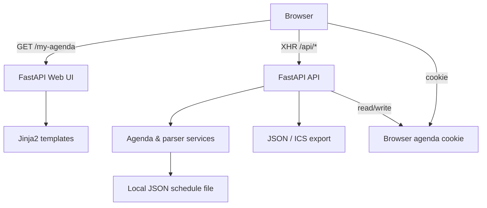
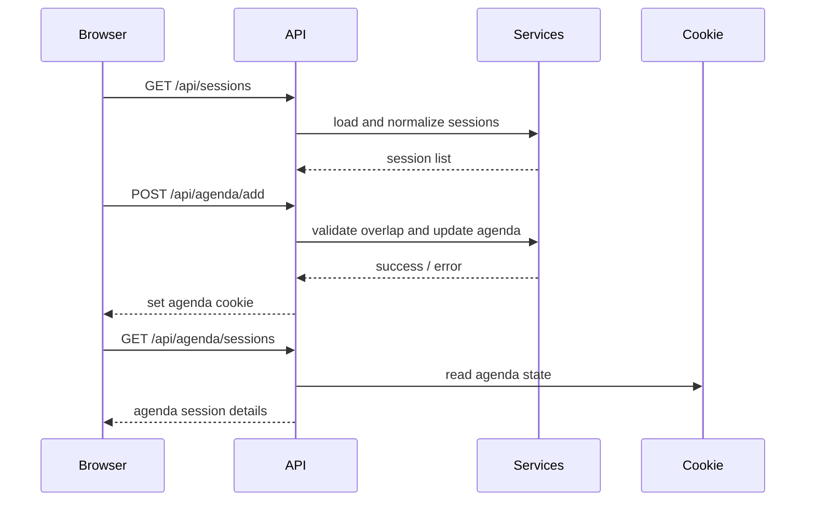

# Open Event Agenda Builder

Build personal agendas from a configurable event schedule with a single FastAPI container, browser-isolated concurrent usage, and only open-source tooling.

<!-- local-container-status:start -->
- Latest local container test: `PASS`
- Executed at (UTC): `2026-04-15T19:32:34Z`
- Verification command: `bash scripts/run-local-container-tests.sh`
- Detailed report: [docs/local-container-test-status.md](docs/local-container-test-status.md)
- Check `health`: `PASS`
- Check `sessions`: `PASS`
- Check `agenda-add`: `PASS`
- Check `agenda-read`: `PASS`
- Check `session-isolation`: `PASS`
- Check `export-json`: `PASS`
- Check `branding`: `PASS`
<!-- local-container-status:end -->

## What It Does

- Loads event sessions from a local JSON schedule file
- Lets each browser build its own agenda with overlap detection
- Exports agendas as JSON or ICS
- Imports previously exported JSON agendas
- Supports concurrent usage through an anonymous essential cookie
- Runs as a single local container with no external SaaS dependency

## Privacy And GDPR-Oriented Design

- No analytics, adtech, telemetry, or third-party trackers
- No user accounts, names, email addresses, or profile storage
- No external agenda fetch during normal operation
- Only one essential browser-session cookie is used: serialized agenda state for browser isolation
- Sample data is neutralized and avoids personal data

This reduces privacy risk, but it is not a legal opinion. Real deployments still need their own records-of-processing, retention review, and legal validation.

## Dependencies and Licenses

The project is implemented with pinned open-source Python dependencies. The exact runtime and dev dependencies are documented in [docs/dependency-transparency.md](docs/dependency-transparency.md).

### Runtime dependencies

| Package | Version | License | Purpose |
|---|---|---|---|
| fastapi | 0.115.0 | MIT | Web framework for API and HTML endpoints |
| uvicorn[standard] | 0.32.0 | BSD-3-Clause | ASGI server for FastAPI |
| jinja2 | 3.1.4 | BSD-3-Clause | HTML template rendering |
| pydantic | 2.9.2 | MIT | Data validation and serialization |
| pydantic-settings | 2.5.2 | MIT | Typed environment configuration |
| icalendar | 6.0.1 | BSD-2-Clause | ICS calendar export generation |
| python-multipart | 0.0.12 | Apache-2.0 | Multipart form / JSON import handling |

### Development and verification dependencies

| Package | Version | License | Purpose |
|---|---|---|---|
| pytest | 8.3.3 | MIT | Automated test execution |
| pytest-asyncio | 0.24.0 | Apache-2.0 | Async support for pytest |
| pytest-cov | 5.0.0 | MIT | Coverage reporting |
| httpx | 0.27.2 | BSD-3-Clause | Test client transport dependencies |
| ruff | 0.7.0 | MIT | Linting and formatting checks |
| mypy | 1.13.0 | MIT | Static type checking |
| ipython | 8.29.0 | BSD-3-Clause | Optional developer shell |

### Additional open-source tooling

- Docker for image build and local container verification
- Bash and curl for smoke test orchestration
- Python 3.12 as the declared runtime

## Quick Start

### Local Python Run

```bash
python3.12 -m venv .venv
source .venv/bin/activate
python -m pip install -r requirements.txt -r requirements-dev.txt
uvicorn app.main:app --reload --port 8082
```

Open `http://localhost:8082` and verify `http://localhost:8082/health`. The main user interface is available at `http://localhost:8082/my-agenda`.

### Local Container Run

```bash
docker build -t open-event-agenda-builder .
docker run --rm -p 8082:8082 open-event-agenda-builder
```

## Configuration

The application is generic and configurable through environment variables:

```bash
APP_NAME="Open Event Agenda Builder"
EVENT_NAME="Sample Event Program"
EVENT_DAY_LABEL="Program Day"
EVENT_DATE="2026-04-15"
EVENT_TIMEZONE="Europe/Berlin"
AGENDA_LABEL="My Agenda"
SCHEDULE_FILE="app/data/sample-sessions.json"
TRACK_FILTER=""
START_TIME="09:00"
END_TIME="18:00"
DATA_SOURCE_NAME="Bundled JSON schedule"
AGENDA_COOKIE_NAME="agenda_state"
AGENDA_COOKIE_SESSION_ONLY=true
AGENDA_COOKIE_MAX_AGE_SECONDS=604800
SECURE_COOKIE=false
```

See [.env.example](.env.example) for the full template.

## Repository Structure

- Code: [app/README.md](app/README.md)
- Tests: [tests/README.md](tests/README.md)
- Deployment: [deployment/README.md](deployment/README.md)
- Documentation: [docs/README.md](docs/README.md)
- Examples: [examples/README.md](examples/README.md)

## Test Plan

The repository uses two verification layers and keeps their documentation in sync with executed results:

1. Python test suite for parser, service, and API behavior.
2. Local container smoke test for the supported deployment mode.

### Python Test Command

```bash
source .venv/bin/activate
python -m pytest
```

### Local Container Test Command

```bash
bash scripts/run-local-container-tests.sh
```

The smoke test:

- Builds the Docker image locally
- Starts the container on `127.0.0.1:18082`
- Verifies `/health`
- Verifies session loading
- Verifies add/export flows
- Verifies browser-scoped agenda isolation using two cookie jars
- Writes machine-readable status to [testing/local-container-status.json](testing/local-container-status.json)
- Writes human-readable status to [docs/local-container-test-status.md](docs/local-container-test-status.md)
- Updates the status block in this README

## Documentation And Test Sync Rule

When behavior changes, update all three together:

1. Code
2. Automated tests
3. The executed command documentation and latest status artifacts

This repository treats documentation as part of the release surface, not as an afterthought.

## Architecture

See [docs/ARCHITECTURE.md](docs/ARCHITECTURE.md) for the current design, including multi-user isolation, stateless process behavior, and privacy controls.

### Architecture diagrams

#### Static view



#### Dynamic view



These diagrams show the implementation’s main actors, where session data is loaded from the bundled JSON schedule, and how browser-specific agenda state is managed through cookie-backed requests.

## Deployment

Only local single-container operation is documented and verified by default. See [docs/DEPLOYMENT.md](docs/DEPLOYMENT.md).

## Example Export Files

- JSON example: [examples/agenda-export.json](examples/agenda-export.json)
- ICS example: [examples/agenda-export.ics](examples/agenda-export.ics)

## Licensing

This project is licensed under Apache License 2.0. See [LICENSE](LICENSE) and [NOTICE](NOTICE).

## Source Material Policy

The bundled sample schedule is original and neutralized. If you adapt public agenda structures, prefer sources with clear reuse rights, and avoid copying logos, trademarks, photos, or personal-profile content. Public-sector schedule formats such as selected NIST event pages can be safer structural references, but you must still verify reuse conditions for the exact materials you copy.
