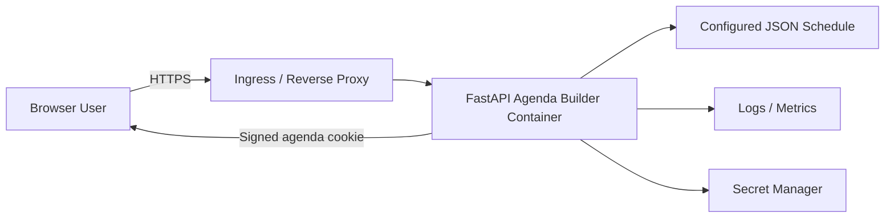

# Architecture Review Board Review

Project: Open Agenda Builder Template

Review date: 2026-04-27

Review rerun timestamp: 2026-04-27 23:34:23 CEST

Review type: Architecture Review Board readiness review

Review skills applied:

- `architecture-patterns`
- `business-alignment`
- `documentation-review`
- `maintainability-technical-debt`
- `scalability-performance`
- `security-threat-modeling`
- `twelve-factor-compliance`
- `software-architect-ai-enterprise-applications`

Review status: Conditional approval for the documented local single-container scope; quality gates need remediation before broader deployment approval

## 1. Executive Summary

The Open Agenda Builder Template is architecturally suitable for its declared scope: a local-first, single-container FastAPI application that lets browser users build personal event agendas from a configurable local JSON schedule.

The current design is intentionally simple and coherent. It uses a modular monolith rather than premature service decomposition, keeps user-specific agenda state outside process memory, avoids a database, and documents a clear local-container verification path.

The multi-skill Architecture Review Board assessment remains conditional approval for local and internal template reuse. The rerun confirms that functional tests pass, but configured lint and type checks fail. The system should not be treated as production-ready for broad public deployment until cookie integrity, cache invalidation, CORS configuration, export responsibility boundaries, operational controls, production deployment assumptions, and code quality gates are tightened.

## 2. Review Scope

In scope:

- Application architecture and component boundaries
- Runtime and deployment model
- API, web, service, parser, and model layering
- State management and browser isolation
- Configuration and containerization approach
- Test and verification evidence
- Fit of architectural patterns to stated purpose

Out of scope:

- Full security audit
- Legal or GDPR compliance opinion
- Performance load test
- Accessibility review
- UI/visual design review
- Cloud production deployment architecture

## 3. Review Method

This review applies the locally installed Codex skills from:

`/Users/thomassuedbroecker/.codex/skills`

The following skill files were used:

| Skill | Local Path | Review Role |
|---|---|---|
| `architecture-patterns` | `/Users/thomassuedbroecker/.codex/skills/architecture-patterns/SKILL.md` | Architecture pattern fit, API design, coupling, anti-patterns |
| `business-alignment` | `/Users/thomassuedbroecker/.codex/skills/business-alignment/SKILL.md` | Business value, stakeholder alignment, quality attributes |
| `documentation-review` | `/Users/thomassuedbroecker/.codex/skills/documentation-review/SKILL.md` | README, architecture docs, diagrams, runbooks, evidence quality |
| `maintainability-technical-debt` | `/Users/thomassuedbroecker/.codex/skills/maintainability-technical-debt/SKILL.md` | Maintainability, code organization, technical debt, test quality |
| `scalability-performance` | `/Users/thomassuedbroecker/.codex/skills/scalability-performance/SKILL.md` | Capacity, bottlenecks, scaling constraints, performance risks |
| `security-threat-modeling` | `/Users/thomassuedbroecker/.codex/skills/security-threat-modeling/SKILL.md` | STRIDE, OWASP risk areas, privacy/security controls |
| `twelve-factor-compliance` | `/Users/thomassuedbroecker/.codex/skills/twelve-factor-compliance/SKILL.md` | Cloud-native and Twelve-Factor alignment |
| `software-architect-ai-enterprise-applications` | `/Users/thomassuedbroecker/.codex/skills/software-architect-ai-enterprise-applications/SKILL.md` | Enterprise production-readiness framing; AI-specific guidance is not directly applicable because this app is not an AI system |

The combined skill review assessed:

- Architecture style selection
- Monolith versus microservices fit
- CQRS applicability
- Event-driven architecture applicability
- Domain-driven design fit
- SOLID and separation-of-concerns alignment
- Enterprise and API pattern usage
- Integration, data, and resilience patterns
- Common architecture anti-patterns
- Business alignment and stakeholder value
- Documentation completeness
- Maintainability and technical debt
- Scalability and performance constraints
- Security and threat modeling
- Twelve-Factor compliance
- Enterprise deployment readiness

The review preserves the skills' output categories for achieved practices, concerns, not-achieved items, assessment tables, and recommendations.

## 4. Review Execution Results

The review was rerun on 2026-04-27 using all imported skills listed above. The rerun included source inspection plus verification commands for tests, linting, and typing.

| Check | Command | Result | ARB Interpretation |
|---|---|---|---|
| Functional test suite | `./.venv/bin/python -m pytest` | Passed: 39 tests, 89% coverage | Functional baseline is acceptable for current scope. |
| Lint/static style gate | `./.venv/bin/python -m ruff check app tests testing` | Failed: 113 findings, 96 auto-fixable | Maintainability gate is not currently met. |
| Type checking gate | `./.venv/bin/python -m mypy app` | Failed: 10 errors in 4 files | Strict typing gate is not currently met. |

Key rerun findings:

- The test suite confirms parser, service, API, browser isolation, import/export, and web-page behavior remain intact.
- `ruff` failures are mostly modernization and formatting issues: deprecated `typing.List`/`Dict`/`Optional`, whitespace on blank lines, unsorted imports, long lines, one unused local variable, and a few unnecessary f-strings.
- `mypy` failures are concentrated in `app/services/agenda_parser.py`, `app/dependencies.py`, `app/routes/api.py`, and `app/main.py`.
- The quality-gate failures do not invalidate the selected architecture pattern, but they increase maintainability and production-readiness risk.

ARB result from rerun:

- Approved for documented local single-container use.
- Not approved for broader production deployment until required actions and quality-gate failures are remediated.

## 5. Architecture Context

The project implements a single FastAPI application that serves:

- HTML pages through Jinja templates
- REST API endpoints under `/api`
- Static assets
- JSON and ICS agenda exports
- A health endpoint

The event schedule source is a local JSON file. Browser-specific agenda state is stored in an essential cookie and passed into service operations through request state. The application process keeps only the normalized session catalog cache, not user-specific agenda state.

The documented deployment mode is a single Docker container verified by `scripts/run-local-container-tests.sh`.

## 6. Architecture Decision Assessment

### 6.1 Modular Monolith

Decision: Use a single deployable FastAPI application.

Assessment: Approved.

Rationale:

- The problem domain is small and cohesive.
- Operational simplicity is more valuable than distributed service boundaries.
- API, web UI, parser, and agenda logic are separated enough for the current scope.
- Microservices would add unnecessary operational and consistency complexity.

Conditions:

- Keep the monolith modular.
- Do not introduce shared mutable user state in process memory.
- Extract services only when concrete complexity appears.

### 6.2 Local JSON Schedule Source

Decision: Use a local JSON schedule file as the source of truth.

Assessment: Approved for the current template.

Rationale:

- Deterministic behavior supports testing.
- No runtime dependency on third-party websites or SaaS APIs.
- Lower privacy and legal reuse risk.
- Easy local customization.

Concern:

- Schedule caching is indefinite. `cache_ttl_seconds` exists in configuration but is not currently applied.

Required action:

- Either document that schedule/config changes require process restart, or implement TTL/file-mtime cache invalidation.

### 6.3 Cookie-Backed Agenda State

Decision: Store browser-specific agenda state in a cookie.

Assessment: Conditionally approved.

Rationale:

- Supports concurrent anonymous browser usage.
- Avoids accounts, profiles, server-side persistence, and database operations.
- Keeps the process stateless for user-specific data.
- Fits the privacy-oriented local-first design.

Concern:

- The cookie is base64-encoded, not signed. A client can modify cookie contents.
- Some flows validate session IDs through the service, but JSON export currently reflects cookie session IDs directly.

Required action:

- Sign cookie state before broader deployment.
- Validate exported agenda data against the current session catalog.
- Document cookie size limits as an architectural constraint.

### 6.4 API And Web Layering

Decision: Separate FastAPI routers into API and web routes, delegate domain behavior to services.

Assessment: Mostly approved.

Rationale:

- `app/routes/api.py` exposes command/query endpoints.
- `app/routes/web.py` owns HTML rendering.
- `app/services/agenda_service.py` owns agenda operations.
- `app/services/agenda_parser.py` owns schedule loading and normalization.

Concern:

- ICS export construction is implemented directly in the API route.

Recommended action:

- Move export formatting into a small export service or domain utility if export behavior grows.

### 6.5 Deployment Model

Decision: Single-container local deployment.

Assessment: Approved for documented scope.

Rationale:

- Dockerfile uses a multi-stage build.
- Runtime uses a non-root user.
- Health check is defined.
- CI runs Python tests and the local container smoke test.

Concern:

- This is not yet a complete cloud production deployment architecture.

Required action before production expansion:

- Define ingress, TLS, allowed origins, secret handling, resource limits, observability, and operational ownership.

## 7. Architecture Patterns Skill Review

### Achieved

- Modular monolith is the correct primary architecture style for the current scope.
- Route, service, parser, model, template, and configuration responsibilities are separated clearly.
- The service layer owns agenda behavior such as add, remove, clear, import validation, conflict detection, and agenda-session resolution.
- The parser owns schedule-file loading, normalization, track filtering, time-window filtering, and cache population.
- Pydantic models provide typed domain/data-transfer structures for sessions and agenda exports.
- User agenda state is not stored in process memory, supporting concurrent browser isolation.
- A single-container deployment model is explicitly documented and verified.
- Health check and container smoke testing provide basic resilience and deployment validation.
- The codebase avoids over-engineered microservices, event buses, CQRS, and database abstractions where they are not needed.

### Concerns

- Cookie-backed agenda state is encoded but not signed, so client-side tampering is possible.
- JSON export currently reflects the agenda session IDs from cookie state directly rather than exporting only service-resolved valid sessions.
- Schedule caching is indefinite, while `cache_ttl_seconds` exists but is not applied.
- CORS is globally permissive while credentials are enabled, which is only acceptable for a local/default template posture.
- ICS export construction lives directly in the API route, mixing controller and export-format responsibilities.
- API command modeling is functional but inconsistent: add uses a query parameter while remove uses a path parameter.

### Not Achieved

- Cookie integrity pattern is not implemented.
- Cache invalidation pattern is not implemented.
- Configurable production-grade CORS policy is not implemented.
- Export formatting is not separated into an export service or adapter.
- No production deployment architecture exists beyond the local single-container model.

### Pattern Analysis Table

| Pattern Or Practice | Usage | Assessment | Notes |
|---|---|---|---|
| Modular monolith | Used | Approved | Correct fit for a small local-first agenda application. |
| Microservices | Not used | Appropriate | Microservices would introduce unnecessary distribution complexity. |
| CQRS | Not used | Appropriate | Read/write complexity does not justify formal CQRS. |
| Event sourcing | Not used | Appropriate | No event replay or audit-history requirement exists. |
| Event-driven architecture | Not used | Appropriate | No asynchronous workflow or integration event need exists. |
| Domain-driven design | Lightweight | Appropriate | Simple domain model is enough; full DDD would be excessive. |
| Service layer | Used | Approved | Agenda behavior is mostly outside HTTP route handlers. |
| Repository pattern | Not used | Appropriate | No database or persistence abstraction is needed. |
| DTO / schema models | Used | Approved | Pydantic models define API and export structures. |
| Dependency injection | Lightweight | Acceptable | FastAPI dependencies provide service and agenda access. |
| Stateless process | Mostly used | Approved with condition | User state is stateless; schedule cache remains process-local. |
| Cookie session state | Used | Conditionally approved | Needs signing and validation hardening. |
| REST API | Used | Approved with concern | Resource modeling can be made more consistent. |
| Health check | Used | Approved | Sufficient baseline for container verification. |
| Circuit breaker | Not used | Appropriate | No external service dependency exists. |
| Retry/fallback | Not used | Appropriate | No remote integration or transient external dependency exists. |
| API gateway/BFF | Not used | Appropriate | Single application serves UI and API without gateway need. |

### Skill-Based Recommendations

| Priority | Current State | Proposed Pattern | Benefits | Trade-offs | Implementation |
|---|---|---|---|---|---|
| High | Cookie agenda state is base64-encoded only. | Signed cookie state. | Protects integrity of browser-scoped state. | Requires secret management and rotation policy. | Add `SECRET_KEY`, sign serialized agenda payload, reject invalid signatures. |
| High | JSON export trusts cookie session IDs. | Validate-before-export service operation. | Prevents invalid/tampered IDs from becoming exported data. | Slight extra service lookup. | Build export payload from `service.get_agenda_sessions(agenda)` and validated IDs. |
| Medium | Cache TTL setting is unused. | Explicit cache policy. | Removes operational ambiguity. | TTL adds invalidation complexity. | Implement TTL/file-mtime invalidation or remove setting and document restart requirement. |
| Medium | CORS is wide open. | Environment-driven CORS allowlist. | Safer production posture. | Requires deployment-specific configuration. | Add `allowed_origins` setting and use it in `CORSMiddleware`. |
| Low | ICS export is route-local. | Export service or adapter. | Keeps route layer thin and export logic testable. | Adds one small module. | Move JSON/ICS export construction to `app/services/agenda_export_service.py`. |
| Low | Add/remove endpoint styles differ. | Consistent REST resource commands. | Cleaner API contract. | Requires small client/test updates. | Use `POST /api/agenda/sessions` with JSON body and keep delete path. |

## 8. Business Alignment Skill Review

### Achieved

- Architecture supports the business goal of a reusable, low-friction agenda builder template.
- Local JSON schedule input keeps customization simple for internal teams.
- Single-container operation reduces operational cost and onboarding effort.
- Privacy-oriented design supports low-risk demo and internal event use cases.
- The architecture avoids avoidable SaaS dependencies, which reduces vendor, legal, and procurement friction.

### Concerns

- The target operating model is narrow: local single-container deployment is well supported, but broader public or enterprise deployment is not yet fully defined.
- No explicit stakeholder matrix exists for event organizers, end users, operators, legal/privacy reviewers, and developers.
- Success metrics are implicit. The repository documents behavior and tests, but not business KPIs such as setup time, schedule import effort, concurrent-user target, or operational support cost.
- Accessibility and usability quality attributes are not covered by the current ARB evidence.

### Not Achieved

- No explicit business capability map.
- No defined non-functional requirement targets for availability, response time, concurrent users, recovery, or support model.
- No formal cost model beyond the implicit low-cost single-container approach.

### Recommendations

| Priority | Business Impact | Technical Approach | Effort | Risk If Not Addressed |
|---|---|---|---|---|
| Medium | Clearer approval boundary for reuse. | Add a short stakeholder and use-case section to architecture docs. | Low | Teams may reuse the template outside its intended constraints. |
| Medium | Better decision-making for deployment expansion. | Define non-functional targets for local, internal, and public deployment modes. | Low | Architecture may be judged without explicit quality targets. |
| Low | Better product/value tracking. | Add success metrics such as setup time, supported agenda size, concurrent browser sessions, and smoke-test duration. | Low | Improvements may be hard to prioritize. |

## 9. Documentation Review Skill Review

### Achieved

- Root README is comprehensive and includes overview, privacy posture, dependencies, quick start, tests, configuration, architecture, deployment, examples, licensing, and source-material policy.
- Architecture documentation exists and describes core design decisions, components, data flow, testing strategy, and constraints.
- Deployment documentation defines the supported local single-container mode and verification command.
- Mermaid static and dynamic diagrams are included in the README.
- Local container verification status is captured in documentation artifacts.
- Dependency transparency is documented.

### Concerns

- Significant architecture decisions are documented narratively, but there is no ADR structure with dated decisions and alternatives.
- C4-style context/container/component diagrams are not complete; current diagrams are useful but lightweight.
- API documentation relies on FastAPI generation and tests, but no explicit API contract document is checked into docs.
- Operational runbook coverage is basic and local-only.
- The ARB review itself identifies production constraints that are not yet reflected as formal deployment modes.

### Not Achieved

- No ADR index or ADR template.
- No formal deployment diagram.
- No explicit operational ownership, incident response, rollback, or production monitoring guide.
- No documented accessibility or browser support baseline.

### Documentation Checklist

| Document Type | Status | Quality | Priority | Notes |
|---|---|---:|---|---|
| README | Good | 4/5 | High | Strong overview and setup guidance. |
| Architecture Overview | Good | 4/5 | High | Clear current-state architecture and constraints. |
| ADRs | Missing | 0/5 | Medium | Add for major decisions. |
| C4 Context | Partial | 2/5 | Medium | Mermaid diagrams exist but are not full C4. |
| C4 Container | Partial | 2/5 | Medium | Single-container view should be formalized. |
| C4 Component | Partial | 2/5 | Low | Component map exists in prose. |
| API Docs | Partial | 3/5 | Medium | FastAPI docs exist at runtime; checked-in contract missing. |
| Deployment Runbook | Partial | 3/5 | Medium | Local mode covered; production mode not covered. |
| Operational Runbook | Partial | 2/5 | Medium | Troubleshooting exists; monitoring/incident response absent. |
| Data Model Docs | Partial | 3/5 | Low | Pydantic models and sample data are readable. |

### Recommendations

| Priority | Missing | Action | Template | Effort |
|---|---|---|---|---|
| Medium | ADRs | Add `docs/adr/0001-local-json-source.md`, `0002-cookie-backed-agenda-state.md`, `0003-single-container-runtime.md`. | ADR | Low |
| Medium | API contract | Add an OpenAPI export or API endpoint reference. | OpenAPI/Markdown | Low |
| Medium | Deployment diagram | Add a single-container deployment diagram and future production deployment placeholder. | Mermaid/C4 | Low |
| Low | Operational runbook | Add schedule update, cache behavior, rollback, and troubleshooting procedures. | Runbook | Low |

## 10. Maintainability And Technical Debt Skill Review

### Achieved

- Codebase is small, cohesive, and easy to navigate.
- Responsibilities are divided across config, dependencies, routes, services, models, templates, and tests.
- Runtime dependencies are explicit and pinned.
- Test suite is fast and covers the core parser, service, API, and browser-isolation behavior.
- Overall test coverage is 89%, above the typical 80% maintainability threshold.
- The architecture avoids speculative abstractions.

### Concerns

- Global service singleton in `app/dependencies.py` is pragmatic but can become a testability and lifecycle concern if the application grows.
- `cache_ttl_seconds` is unused, which creates configuration debt.
- Export formatting in `app/routes/api.py` increases route-layer responsibility.
- Some tests access internal/private state, for example directly setting `_sessions_by_id` in fixtures.
- Configured `ruff` and `mypy` quality gates currently fail.

### Not Achieved

- No technical debt register.
- No complexity metrics beyond coverage.
- No passing automated quality gate evidence for `ruff` and `mypy`.

### Technical Debt Assessment Table

| Area | Severity | Effort To Fix | Interest | Priority |
|---|---|---|---|---|
| Unsigned cookie state | Medium | Medium | Medium | High |
| Unused cache TTL setting | Medium | Low | Medium | High |
| Failing `ruff` gate | Medium | Low/Medium | Medium | High |
| Failing `mypy` gate | Medium | Low/Medium | Medium | High |
| Export logic in route layer | Low | Low | Low | Medium |
| Open CORS default | Medium | Low | Medium | High |
| Missing ADRs | Low | Low | Low | Medium |
| Global service singleton lifecycle | Low | Medium | Low | Low |

### Code Quality Metrics

| Metric | Current | Target | Status |
|---|---:|---:|---|
| Test coverage | 89% | >80% | Good |
| Python tests | 39 passed | Passing | Good |
| Dependency count | 7 runtime packages | Minimal/fit-for-purpose | Good |
| Complexity | Not measured | Functions generally small | Partial |
| Code duplication | Not measured | <5% | Partial |
| Lint gate | 113 `ruff` findings | Passing `ruff` | Failing |
| Static typing gate | 10 `mypy` errors | Passing `mypy` | Failing |

### Recommendations

| Priority | Issue | Refactoring Approach | Effort | Benefit |
|---|---|---|---|---|
| High | Cookie integrity risk | Add signed cookie helper and tests for tampering. | Medium | Reduces future trust-boundary debt. |
| High | Cache behavior ambiguity | Implement TTL/file-mtime invalidation or remove unused setting. | Low | Aligns config and behavior. |
| High | Failing lint gate | Run `ruff --fix` where safe, then manually resolve remaining line/import/unused findings. | Low/Medium | Restores configured maintainability gate. |
| High | Failing typing gate | Add missing generic annotations, middleware typing, safer Pydantic return typing, and handle untyped `icalendar`. | Low/Medium | Restores strict type-check confidence. |
| Medium | Route export responsibility | Extract JSON/ICS export generation to a service. | Low | Keeps controllers thin. |
| Medium | Quality gate evidence | Add `ruff` and `mypy` commands to CI/verification docs after they pass. | Low | Improves maintainability confidence. |

## 11. Scalability And Performance Skill Review

### Achieved

- User-specific agenda state is not stored in server memory, which supports horizontal scaling better than process-local sessions.
- Local JSON schedule cache avoids repeated file parsing for normal traffic.
- No database removes query, indexing, connection-pool, and N+1 risks.
- The app has simple request/response flows and no long-running background workloads.
- Container health check and smoke test validate basic availability behavior.

### Concerns

- Browser cookie size limits constrain maximum agenda size.
- Local JSON file and process-local schedule cache work for the current scope but are not a high-volume event-platform pattern.
- No load, stress, spike, or endurance test evidence exists.
- No response-time or concurrent-user targets are defined.
- No rate limiting or throttling exists.
- Multi-instance schedule update consistency is not addressed.

### Not Achieved

- No performance baseline.
- No capacity plan.
- No autoscaling strategy.
- No monitoring/alerting for latency, error rate, memory, or CPU.

### Performance Metrics Table

| Metric | Target | Current | Status | Notes |
|---|---:|---:|---|---|
| Python test runtime | Fast | 0.21s | Good | Unit/API suite is fast. |
| Response time p95 | Not defined | Not measured | Missing | Define target before production use. |
| Throughput RPS | Not defined | Not measured | Missing | Load testing not performed. |
| Concurrent users | Not defined | Browser isolation tested with 2 clients | Partial | Good functional evidence, not capacity evidence. |
| Memory utilization | Not defined | Not measured | Missing | Container sizing not defined. |
| Error rate | Not defined | Tests pass | Partial | No runtime SLO. |

### Recommendations

| Priority | Bottleneck Or Gap | Solution | Expected Improvement | Effort | Cost Impact |
|---|---|---|---|---|---|
| Medium | Undefined capacity target | Define expected schedule size, agenda size, and concurrent users. | Clear scaling boundary. | Low | None |
| Medium | No load baseline | Add a simple local load test for `/api/sessions`, add/remove, export. | Detects regression and cookie-size limits. | Medium | Low |
| Medium | Cookie size constraint | Add validation and user-facing error for oversized agenda state. | Prevents silent failure at browser/proxy limits. | Low | None |
| Low | Process-local cache | Document restart/update semantics or add mtime invalidation. | Predictable schedule updates. | Low | None |

## 12. Security And Threat Modeling Skill Review

### Achieved

- No user accounts, passwords, profiles, analytics, telemetry, or third-party trackers.
- Minimal personal-data exposure by design.
- Container runs as a non-root user.
- Dependencies are pinned and documented.
- Agenda operations validate session IDs in add/import flows.
- Cookie is `HttpOnly` and `SameSite=Lax`.

### Concerns

- Cookie state is not cryptographically signed.
- `SECURE_COOKIE` defaults to false, which is acceptable for local HTTP but unsafe for HTTPS production defaults.
- CORS is open with credentials enabled.
- No rate limiting exists for import or agenda operations.
- Uploaded JSON import size and content type are not constrained.
- No security headers middleware is configured.
- No automated dependency vulnerability scan is documented.

### Not Achieved

- No formal STRIDE threat model document.
- No signed cookie or server-side integrity check.
- No production security baseline.
- No incident response or security monitoring runbook.

### STRIDE Threat Model Summary

| Threat Category | Likelihood | Impact | Current Mitigation | Status |
|---|---|---|---|---|
| Spoofing | Low | Low | No accounts or identity model. | Acceptable |
| Tampering | Medium | Medium | Normal API paths validate IDs, but cookie state is unsigned. | Needs action |
| Repudiation | Low | Low | No authenticated user actions; logs are basic. | Acceptable for local scope |
| Information Disclosure | Low | Medium | No personal profiles; cookie contains agenda state. | Partial |
| Denial of Service | Medium | Low/Medium | No rate limits or upload-size limits. | Needs action before public use |
| Elevation of Privilege | Low | Low | No roles/admin functions. | Acceptable |

### Recommendations

| Priority | Attack Vector | Impact | Mitigation | Effort | Reference |
|---|---|---|---|---|---|
| High | Client modifies agenda cookie. | Invalid state trusted by future features or export. | Sign cookie and reject invalid signatures. | Medium | OWASP Cryptographic Failures |
| High | Cross-origin credentialed requests in non-local deployment. | Unintended browser interactions. | Configure allowed origins by environment. | Low | OWASP Security Misconfiguration |
| Medium | Large JSON import. | Memory/request abuse. | Enforce file size and schema limits. | Low | OWASP DoS controls |
| Medium | Missing secure headers. | Browser hardening gap. | Add security headers middleware or proxy config. | Low | OWASP Secure Headers |
| Medium | Vulnerable dependencies over time. | Supply-chain exposure. | Add dependency vulnerability scan to CI. | Low | OWASP Vulnerable Components |

## 13. Twelve-Factor Compliance Skill Review

### Factor Compliance Table

| Factor | Status | Score | Notes |
|---|---|---:|---|
| I. Codebase | Compliant | 10 | Single Git repository and codebase. |
| II. Dependencies | Compliant | 9 | Explicit pinned Python dependencies; system dependencies mostly in Dockerfile. |
| III. Config | Mostly compliant | 8 | Environment-driven settings; CORS origins and secret key are missing. |
| IV. Backing Services | Mostly compliant | 8 | Schedule file is config-driven; no external services. |
| V. Build, Release, Run | Mostly compliant | 8 | Docker build/run split exists; formal release/version rollback process is minimal. |
| VI. Processes | Mostly compliant | 8 | User state is stateless; schedule cache and local file source remain process-local concerns. |
| VII. Port Binding | Compliant | 10 | App binds directly through Uvicorn on port 8082. |
| VIII. Concurrency | Mostly compliant | 8 | Browser state supports multi-instance use; no capacity target or orchestrator config. |
| IX. Disposability | Mostly compliant | 8 | Fast startup and health check; graceful shutdown behavior is basic. |
| X. Dev/Prod Parity | Partial | 7 | Local container parity exists; no multi-environment production profile. |
| XI. Logs | Mostly compliant | 8 | Logs go to stdout/stderr; structured logging/observability absent. |
| XII. Admin Processes | Mostly compliant | 8 | Smoke tests and scripts exist; operational admin commands are minimal. |
| Overall Score | Partial | 100/120 | 83% |

### Compliant Factors

- Codebase
- Dependencies
- Port binding

### Partially Compliant Factors

- Config
- Backing services
- Build, release, run
- Processes
- Concurrency
- Disposability
- Dev/prod parity
- Logs
- Admin processes

### Non-Compliant Factors

- None for the documented local single-container scope.

### Recommendations

| Factor | Gap | Required Changes | Priority | Effort |
|---|---|---|---|---|
| III. Config | Missing production CORS and signing secret config. | Add `ALLOWED_ORIGINS` and `SECRET_KEY` settings. | High | Low/Medium |
| VI. Processes | Schedule cache behavior depends on process lifecycle. | Document restart semantics or add invalidation. | Medium | Low |
| X. Dev/Prod Parity | Only local container mode is verified. | Define additional environment profiles before claiming production support. | Medium | Medium |
| XI. Logs | Logs are not structured and no metrics/tracing exist. | Add structured logging guidance and observability plan. | Low | Medium |

## 14. Enterprise Architecture Skill Review

The `software-architect-ai-enterprise-applications` skill was applied only for enterprise production-readiness framing. The Open Agenda Builder Template is not an AI, LLM, RAG, or agent workflow system, so AI-specific architecture guidance is not directly applicable.

### Business Context

The application supports lightweight agenda-building for configurable events. It is best suited for local demos, internal events, or template-based customization where low operational overhead and privacy simplicity matter more than enterprise collaboration features.

### Functional Requirements

- Load event sessions from local JSON.
- Show sessions in browser UI.
- Maintain browser-scoped personal agenda.
- Detect overlapping sessions.
- Export agenda as JSON and ICS.
- Import JSON agenda exports.
- Verify local container behavior.

### Non-Functional Requirements

Currently explicit:

- Local-first privacy posture.
- Stateless user agenda behavior.
- Single-container operation.
- Open-source dependency stack.

Needed before enterprise use:

- Security baseline.
- Observability baseline.
- Capacity targets.
- Operational ownership.
- Deployment environment model.
- Data retention and legal review.

### Proposed Enterprise-Ready Architecture

For the current scope, keep the single-container modular monolith. For enterprise deployment, add production controls around it rather than decomposing the application prematurely:

- Ingress or reverse proxy with TLS.
- Environment-specific CORS allowlist.
- Signed cookie secret from a secret manager.
- Structured logging and basic metrics.
- Container resource requests/limits.
- Deployment-specific schedule source and update procedure.
- CI quality gates for tests, linting, typing, and dependency scanning.

### Architecture Diagram



### Technology Stack Suggestion

- Keep FastAPI, Pydantic, Jinja2, Uvicorn, and Docker.
- Add signed-cookie support using a framework-supported signer or small cryptographic helper.
- Use platform secret management for signing keys.
- Use CI dependency scanning before public deployment.
- Add reverse-proxy security headers for production.

### Risks And Trade-Offs

- Keeping cookie-backed state preserves privacy and operational simplicity, but limits agenda size and multi-device synchronization.
- Adding a database would enable synchronization and audit history, but would increase privacy, operational, and compliance burden.
- Keeping a local JSON schedule preserves deterministic behavior, but requires a clear schedule update process.
- Avoiding microservices keeps cost low, but all runtime responsibilities remain in one deployable unit.

### Implementation Roadmap

1. Harden existing local architecture: signed cookies, validated exports, configurable CORS, cache-policy fix.
2. Improve evidence: ADRs, API contract, deployment diagram, runbook, load baseline.
3. Add production controls only if deployment scope expands: ingress/TLS, secret manager, observability, dependency scanning, resource limits.
4. Re-review architecture if authentication, collaboration, persistent storage, external schedule ingestion, or enterprise event scale is added.

## 15. Quality Attribute Assessment

| Quality Attribute | Rating | Assessment |
|---|---:|---|
| Modularity | Green | Clear package split across routes, services, models, config, templates, and tests. |
| Maintainability | Yellow | Small codebase and good tests, but configured `ruff` and `mypy` gates currently fail. |
| Testability | Green | Unit/API tests plus container smoke test cover the main behavior and deployment path. |
| Scalability | Yellow | Stateless user agenda design helps horizontal scaling, but cookie size and local file source limit growth. |
| Security | Yellow | Non-root container and minimal data model are good; unsigned cookie and open CORS need remediation. |
| Privacy | Green | No accounts, analytics, telemetry, external assets, or persistent personal profile storage. |
| Operability | Yellow | Health endpoint and smoke test exist; observability and runtime configuration controls are minimal. |
| Portability | Green | Standard Python/FastAPI/Docker stack with pinned dependencies. |
| Extensibility | Yellow | Good for simple agenda use cases; import/export and schedule-source abstractions would need strengthening for expansion. |

## 16. ARB Pattern Review

| Pattern Or Practice | Usage | ARB Assessment | Notes |
|---|---|---|---|
| Modular monolith | Used | Approved | Correct fit for current scope. |
| Service layer | Used | Approved | Agenda operations are mostly outside route handlers. |
| Repository pattern | Not used | Acceptable | No database or persistence layer exists. |
| CQRS | Not used | Acceptable | Current command/query split does not require formal CQRS. |
| Event-driven architecture | Not used | Acceptable | No async workflow or integration event need exists. |
| Stateless process | Partially used | Approved with condition | User agenda is stateless; schedule catalog cache remains process-local. |
| Cookie session state | Used | Conditionally approved | Needs signing and validation hardening. |
| Single-container deployment | Used | Approved for local scope | Not sufficient as a public cloud production reference by itself. |
| REST API | Used | Approved with minor concern | Endpoint style is functional but not fully consistent. |
| Health check | Used | Approved | Suitable baseline for container verification. |

## 17. Key Risks

### Risk 1: Client-Controlled Agenda State Integrity

Severity: Medium

The browser agenda cookie can be modified by a client because it is encoded but not signed.

Impact:

- Tampered session IDs can enter request state.
- Export behavior may reflect invalid IDs.
- Future features could accidentally trust client-provided agenda data more deeply.

Required mitigation:

- Use signed cookie state.
- Revalidate agenda session IDs before export and other derived operations.

### Risk 2: Cache Behavior Is Not Explicitly Governed

Severity: Medium

The parser caches sessions indefinitely, while configuration exposes `cache_ttl_seconds`.

Impact:

- Schedule updates may not appear until process restart.
- Operators may assume TTL behavior exists when it does not.

Required mitigation:

- Implement cache TTL/file-change invalidation, or remove the unused setting and document restart-required behavior.

### Risk 3: Open CORS Defaults

Severity: Low to Medium

The application enables permissive CORS while allowing credentials.

Impact:

- Acceptable for local development.
- Risky if copied into an internet-facing deployment without adjustment.

Required mitigation:

- Make allowed origins configurable.
- Document secure deployment defaults.

### Risk 4: Export Logic In Route Layer

Severity: Low

ICS export is built directly in the API route.

Impact:

- Route layer may become harder to test and maintain as export formats grow.

Recommended mitigation:

- Move export construction into an export service when a second export-related change is needed.

## 18. Required Actions For Conditional Approval

The following actions are required before approving the architecture for broader internal or external deployment:

1. Sign and validate the agenda cookie.
2. Validate agenda exports against the session catalog.
3. Resolve the cache TTL mismatch by implementing invalidation or documenting restart-required behavior.
4. Replace open CORS defaults with environment-driven allowed origins.
5. Make `ruff check app tests testing` pass.
6. Make `mypy app` pass or explicitly narrow the configured type-checking scope.
7. Add architecture documentation for deployment beyond local single-container usage if such usage is intended.

## 19. Recommended Improvements

These are not blockers for current local-template usage:

1. Introduce an `AgendaExportService` if export complexity grows.
2. Normalize API command design, for example `POST /api/agenda/sessions` with JSON body.
3. Add a lightweight Architecture Decision Record folder for major choices.
4. Add tests for tampered cookies and invalid session IDs in exported agenda state.
5. Add a short operational runbook for schedule updates and cache behavior.
6. Add the passing `ruff`, `mypy`, and `pytest` checks to CI once lint/type debt is resolved.

## 20. Gap Closure Plan

This section defines the recommended implementation steps to close the gaps found by the ARB review.

### Phase 1: Restore Quality Gates

Goal: make the configured engineering quality checks pass before deeper architectural changes.

1. Fix `ruff` findings.
   - Run `./.venv/bin/python -m ruff check app tests testing --fix`.
   - Manually resolve remaining line-length, import-order, unused-variable, and unsafe-fix findings.
   - Replace deprecated `typing.List`, `typing.Dict`, and `typing.Optional` usage with Python 3.12 native annotations.
   - Acceptance criteria: `./.venv/bin/python -m ruff check app tests testing` passes.

2. Fix `mypy` errors.
   - Add missing generic type parameters such as `dict[str, object]`.
   - Add middleware function type annotations in `app/main.py`.
   - Remove `Any` return leakage from `deserialize_agenda_cookie`.
   - Decide how to handle untyped `icalendar`: add a local ignore for that import, configure `ignore_missing_imports`, or wrap ICS generation behind a typed local service boundary.
   - Acceptance criteria: `./.venv/bin/python -m mypy app` passes.

3. Re-run baseline tests.
   - Run `./.venv/bin/python -m pytest`.
   - Acceptance criteria: all tests pass and coverage remains above 80%.

### Phase 2: Harden Cookie-Backed Agenda State

Goal: remove the main client-side state integrity risk.

1. Add signed agenda cookie support.
   - Add a `SECRET_KEY` or `AGENDA_COOKIE_SECRET` setting.
   - Sign the serialized agenda payload.
   - Reject invalid signatures by returning a fresh empty agenda.
   - Keep the cookie `HttpOnly` and `SameSite=Lax`.
   - Use `SECURE_COOKIE=true` for HTTPS deployment guidance.

2. Add tamper tests.
   - Test invalid signatures.
   - Test malformed payloads.
   - Test that tampered agenda state does not leak into API results.

3. Validate export state through the service.
   - Build JSON export session IDs from service-resolved sessions instead of directly trusting `agenda.sessions`.
   - Ensure invalid cookie session IDs are ignored or rejected consistently.

Acceptance criteria:

- Tampered agenda cookies do not produce trusted agenda state.
- JSON and ICS exports only include valid current schedule sessions.
- `pytest`, `ruff`, and `mypy` pass.

### Phase 3: Resolve Cache Policy Ambiguity

Goal: align configuration and runtime behavior.

1. Choose the cache policy.
   - Option A: implement TTL and/or file-mtime invalidation using `cache_ttl_seconds`.
   - Option B: remove `cache_ttl_seconds` and document that schedule/config changes require process restart.

2. Add tests for the selected behavior.
   - For TTL/file-mtime: verify schedule reload after invalidation.
   - For restart-required: verify documentation and remove misleading unused config.

Acceptance criteria:

- No unused cache configuration remains.
- Operators have a clear schedule update procedure.

### Phase 4: Configure CORS And Browser Security Posture

Goal: avoid unsafe production defaults.

1. Add environment-driven allowed origins.
   - Add `allowed_origins` setting.
   - Use a restrictive default or local-only default.
   - Update `.env.example`.
   - Update deployment documentation.

2. Add browser/security header guidance.
   - Either add middleware in FastAPI or document reverse-proxy headers.
   - Include `Content-Security-Policy`, `X-Content-Type-Options`, and related baseline headers where appropriate.

Acceptance criteria:

- CORS is no longer hardcoded as `allow_origins=["*"]` for all deployments.
- Production deployment guidance includes secure cookie and header settings.

### Phase 5: Separate Export Responsibilities

Goal: keep API routes thin and make export behavior independently testable.

1. Create an export service or utility module.
   - Move JSON export preparation out of `app/routes/api.py`.
   - Move ICS calendar construction out of `app/routes/api.py`.
   - Keep route handlers focused on HTTP concerns.

2. Add focused tests.
   - Test JSON export payload generation.
   - Test ICS content generation.
   - Test empty agenda and invalid session behavior.

Acceptance criteria:

- API route complexity is reduced.
- Export behavior has service-level tests.

### Phase 6: Improve Documentation And ARB Evidence

Goal: make future reviews faster and more evidence-based.

1. Add ADRs.
   - `docs/adr/0001-local-json-schedule-source.md`
   - `docs/adr/0002-cookie-backed-agenda-state.md`
   - `docs/adr/0003-single-container-runtime.md`
   - `docs/adr/0004-cache-policy.md`

2. Add API contract documentation.
   - Export OpenAPI schema or write a concise API reference.

3. Add deployment and operations documentation.
   - Single-container deployment diagram.
   - Schedule update runbook.
   - Cache behavior runbook.
   - Production-readiness checklist.

Acceptance criteria:

- Major architecture decisions have decision records.
- Operators can update schedules and verify the deployment without reading source code.

### Phase 7: Add CI Quality Gates

Goal: prevent regression after remediation.

1. Update GitHub Actions.
   - Run `pytest`.
   - Run `ruff check app tests testing`.
   - Run `mypy app`.
   - Keep the container smoke test.

2. Update README verification instructions.
   - Document the full local verification command set.

Acceptance criteria:

- Pull requests fail when tests, lint, typing, or smoke tests fail.
- README and CI use the same verification commands.

### Recommended Implementation Order

1. Phase 1: Restore `ruff` and `mypy`.
2. Phase 2: Sign cookies and validate exports.
3. Phase 3: Resolve cache policy.
4. Phase 4: Configure CORS/security defaults.
5. Phase 5: Extract export service.
6. Phase 6: Add ADRs and operational documentation.
7. Phase 7: Add CI quality gates.

### Final Closure Criteria

The ARB gaps are considered closed when:

- `./.venv/bin/python -m pytest` passes.
- `./.venv/bin/python -m ruff check app tests testing` passes.
- `./.venv/bin/python -m mypy app` passes.
- Local container smoke test passes.
- Cookie tampering tests pass.
- Export validation tests pass.
- Cache behavior is implemented or explicitly documented.
- CORS is environment-driven.
- ADRs and operational docs are added.

## 21. Approval Recommendation

Recommendation: Conditionally approve for the documented local single-container scope.

Approved for:

- Local single-container execution
- Internal demos
- Template-based customization
- Privacy-oriented agenda-building use cases without accounts or persistent server-side user data

Not approved without further work for:

- Public internet-facing production deployment
- Multi-device synchronized personal agendas
- Authenticated collaboration
- Long-term audit retention
- High-volume event-platform operation
- Any release process that requires passing configured lint and strict typing gates

## 22. Verification Evidence

Review evidence:

- Source inspection of application, service, parser, model, configuration, container, and test files.
- Architecture documentation review.
- Deployment documentation review.
- Local Python test execution.
- Local lint check execution.
- Local strict type-check execution.

Verification result:

```text
./.venv/bin/python -m pytest
39 passed
Total coverage: 89%

./.venv/bin/python -m ruff check app tests testing
Failed: 113 findings
96 fixable with --fix

./.venv/bin/python -m mypy app
Failed: 10 errors in 4 files
```

## 23. ARB Decision Record

Decision: Conditional approval for local single-container use; production approval deferred

Decision owner: Architecture Review Board

Conditions:

- Complete required actions before broader deployment.
- Keep documented scope aligned with verified runtime behavior.
- Resolve configured lint and typing gates before claiming production readiness.
- Re-review if the project adds authentication, database persistence, cloud deployment, external schedule ingestion, or collaborative agenda features.
